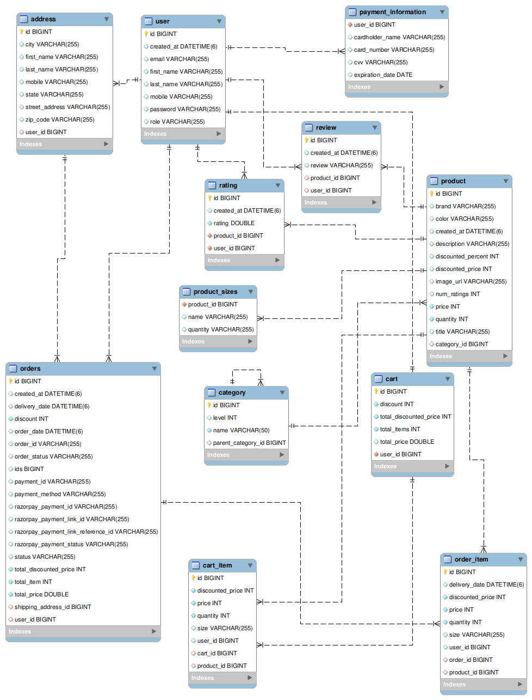

# E-Commerce Backend

## Rest API's for the E-Commerce Website

## Backend Technologies

- Spring Boot
- Maven
- Spring Data Jpa
- Hibernate
- Spring Security
- Mysql
- Lombok
- Razorpay API Integration

## Table of Contents
- [Features](#features)
- [Prerequisites](#prerequisites)
- [Getting Started](#getting-started)
- [API Endpoints](#api-endpoints)
- [Database Configuration](#database-configuration)<!-- - [Testing #testing) -->
- [Contributing](#contributing)
- [Contributors](#Contributors)

## Features

- User registration and authentication.
- Add item to cart.
- Create order.
- Make payment using razorypay.
- Viewing order history.
- Admin functionality for managing products and changing order status.

## Prerequisites

Before you begin, ensure you have met the following requirements:
- Spring Boot, Maven, Spring Data JPA, Hibernate, Spring Security,MySQL, API Integration.

### ER DIGRAM


## Getting Started

To get started, follow these steps:
1. Clone the project: `https://github.com/MahangareRohan1203/E-Commerce`
2. Configure the database in `application.properties`.
3. Build and run the application.

## API Endpoints
API Dcoumentation `https://documenter.getpostman.com/view/24854607/2s9YR9YCt7`

## Database Configuration

Configure your database settings in `application.properties`:

```properties
server.port=5454

# Database specific properties
spring.datasource.url=
spring.datasource.driver-class-name=com.mysql.cj.jdbc.Driver
spring.datasource.username=
spring.datasource.password=

# ORM software specific properties
spring.jpa.hibernate.ddl-auto=update
spring.jpa.show-sql=true
```

## Contributors
- Rohan Mahangare


## Contributing

Contributions are welcome! If you'd like to contribute to this project, please follow these steps:
1. Fork the repository.
2. Create a new branch for your feature or bug fix.
3. Make your changes and commit them.
4. Push the changes to your fork.
5. Create a pull request explaining your changes.


## Contact

For any questions or suggestions, feel free to contact me at mahangarerohan@gmail.com.


